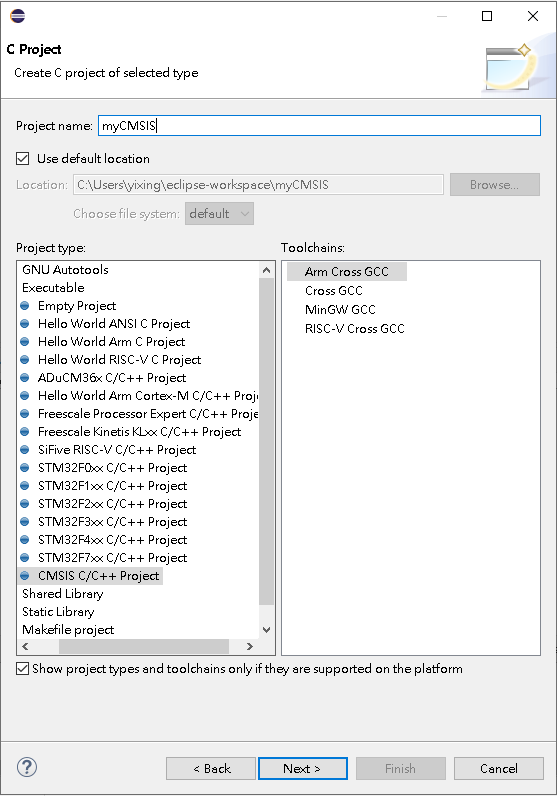
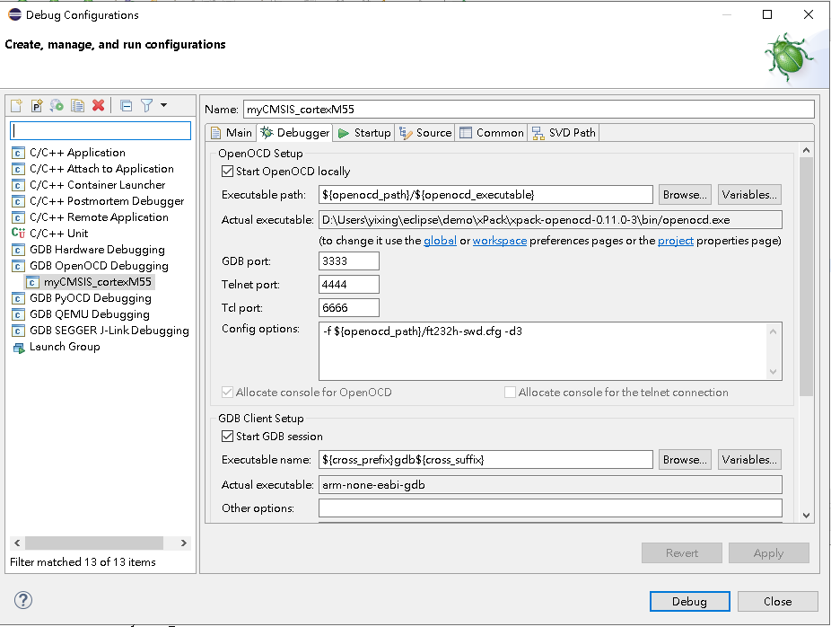

# Eclipse + OpenOCD + ARM GCC + CMSIS Pack Manager PlugIn

----

## 環境安裝

下載安裝Eclipse IDE for Embedded C/C++ Developers

https://www.eclipse.org/downloads/packages/release/2021-12/r/eclipse-ide-embedded-cc-developers

安裝至D:\Users\username\eclipse    


更新Eclipse Embedded CDT plug-ins v6.1.2    
[https://eclipse-embed-cdt.github.io/blog/2021/03/05/plugins-v6.1.2-released](https://eclipse-embed-cdt.github.io/blog/2021/03/05/plugins-v6.1.2-released/)

Instell New Software加入Embedded CDT plug-ins weblink     
https://download.eclipse.org/embed-cdt/releases/6.1.2/p2/


更新Embedded CDT plug-ins


新增CMSIS-Pack Manager PlugIn, 下載zip至D:\Users\username\eclipse\demo\ARM-software

https://github.com/ARM-software/cmsis-pack-eclipse/releases/tag/v2.6.1

Instell New Software加入CMSIS-Pack Manager Plug (D:\Users\username\eclipse\demo\ARM-software\CmsisPackPlugIn2.6.1.zip)


GUI加入CMSIS-Pack Manager


下載ARM CMSIS 5.8.0, CMSIS-Pack Manager將檔案存放在C:/Users/username/AppData/Local/Arm/Packs


下載xpack-dev-tools arm-none-eabi-gcc,openocd,windows-build-tools, 解壓縮至D:\Users\username\eclipse\demo\xPack

[https://github.com/xpack-dev-tools/arm-none-eabi-gcc-xpack/releases/tag/v10.3.1-2.3](https://github.com/xpack-dev-tools/arm-none-eabi-gcc-xpack/releases/tag/v10.3.1-2.3)

[https://github.com/xpack-dev-tools/openocd-xpack/releases/tag/v0.11.0-3](https://github.com/xpack-dev-tools/openocd-xpack/releases/tag/v0.11.0-3)

[https://github.com/xpack-dev-tools/windows-build-tools-xpack/releases/tag/v4.2.1-2](https://github.com/xpack-dev-tools/windows-build-tools-xpack/releases/tag/v4.2.1-2)


設定MCU Global Arm Toolchans Paths, D:\Users\username\eclipse\demo\xPack\xpack-arm-none-eabi-gcc-10.3.1-2.3\bin


設定MCU Global Build Tools Paths, D:\Users\username\eclipse\demo\xPack\xpack-windows-build-tools-4.2.1-2\bin


設定MCU Global OpenOCD Path, D:\Users\username\eclipse\demo\xPack\xpack-openocd-0.11.0-3\bin


設定CMSIS-Packs目錄, C:/Users/username/AppData/Local/Arm/Packs


---

## 新增CMSIS專案

新增C/C++ Project專案


選擇C Managed Build


選擇CMSIS C/C++ Project type, ToolChains選擇Arm Cross GCC



Device選擇ARMCM55


加入main.c

```
#include <stdio.h>

int
main(void)
{
  printf("Hello Arm World!" "\n");
  return 0;
}
```

開啟myCMSIS_cortexM55.rteconfig , 勾選CMSIS Core和Device Startup, Ctrl + S 自動複製到myCMSIS_cortexM55專案的RTE


修改專案Properties


將Arm famly cortex-m3改為cortex-m33


勾選"Do not use syscalls"


Build Project


編譯通過


使用Zadig對FT232H (VID 0403, PID 0614)使用winUSB取代

https://zadig.akeo.ie/


由於Windows inbox driver 支援FTDI Serial裝置 , Windows將FT232H視定為COM and LPT裝置


winUSB取代後, Windows將FT232H視為通用序列匯流排裝置


設定Debug Configurations


Debugger Config options加入openocd command



D:\Users\username\eclipse\demo\xPack\xpack-openocd-0.11.0-3\bin\ft232h-swd.cfg

```
source [find interface/ftdi/ft232h-module-swd.cfg]
source [find target/stellaris.cfg]
```

按Debug,可以看到openocd 認到FT232H, 但FT232H沒接裝置


